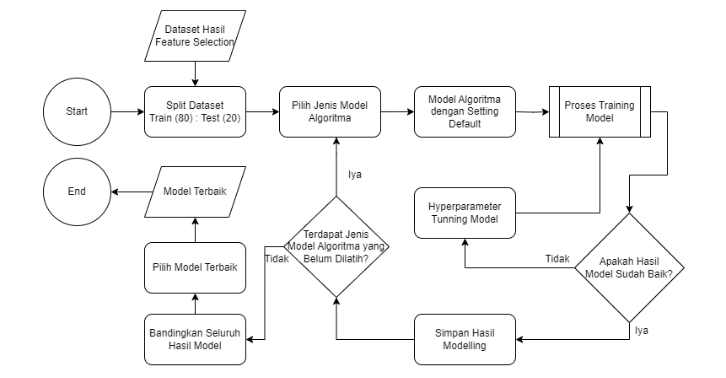

# Background
Sebuah perusahaan asuransi mencoba melakukan perluasan bisnis dengan melakukan cross-selling produk asuransi kendaraan kepada para customer pemegang polis asuransi kesehatan.

Sayangnya hasil dari upaya cross-selling yang dilakukan nampaknya belum maksimal. Dari total 381,109 customer, hanya **12.26%** cutomer yang tertarik pada asuransi kendaraan yang ditawarkan. Nilai conversion rate yang rendah ini mengindikasikan adanya ketidakefektifan dalam strategi pemasaran.

# Goal
Tujuan dari projek ini adalah untuk **meningkatkan konversi penjualan** asuransi kendaraan melalui penargetan yang lebih efektif.

# Business Metric
Business metric yang digunakan adalah *conversion rate*, yaitu tingkat persentase pelanggan yang menerima tawaran cross-selling asuransi kendaraan.

# Exploratory Data Analysis (EDA)
**1. Karakteristik Customer berdasarkan Kelompok Umur dan Jenis Kelamin**

Kelompok umur Middle-Age Adults (45-64 tahun) baik laki-laki maupun perempuan memiliki tingkat ketertarikan tertinggi terhadap asuransi kendaraan, yaitu masing-masing sebesar 18.7% dan 17.3%

**2. Karakteristik Customer berdasarkan Kerusakan Kendaraan**

Sebesar 23.8% customer yang pernah mengalami kerusakan kendaraan tertarik dengan asuransi kendaraan. Sedangkan hanya 0.5% customer yang tidak pernah mengalami kerusakan kendaraan yang tertarik terhadap asuransi kendaraan.

**3. Karakteristik Customer berdasarkan Umur Kendaraan**

Customer yang memiliki umur kendaraan di atas 2 tahun memiliki tingkat ketertarikan tertinggi terhadap asuransi kendaraan, yaitu sebesar 29.4%

**4. Karakteristik Customer berdasarkan Kepemilikan Asuransi Kendaraan Sebelumnya**

Sebesar 22.5% customer yang belum memiliki asuransi kendaraan sebelumnya tertarik terhadap asuransi kendaraan yang ditawarkan. Sedangkan customer yang sudah memiliki asuransi kendaraan sebelumnya hanya 0.1% saja yang tertarik.

**5. Karakteristik Customer berdasarkan Region Code**

Sebagian besar customer yang tertarik dengan asuransi kendaraan berasal dari Region Code 28 yaitu sebanyak 19.917 customer.
Sedangkan dari Segi persentase, Region Code 38 memiliki tingkat persentase tertinggi yaitu mencapai 19.2%

**6. Karakteristik Customer berdasarkan Policy Sales Channel**

Channel yang paling banyak memperoleh customer adalah channel 26 dan 124.
Adapun dari segi persentase, channel 157 memiliki persentase tertinggi yaitu sebesar 26.8%

# Data Pre-processing
Data Pre-processing yang dilakukan adalah sebagai berikut:

1. Handle Missing Values and Duplicates 
Tidak ada missing values dan duplicates pada dataset.
2. Handle Outlier  
Handling outlier hanya dilakuan pada fitur ‘Annual_Premium’ menggunakan IQR (Interquartile Range) karena fitur lain tidak memiliki outlier.
3. Feature Transformation  
Pada fitur numerik dilakukan _standard scaling_ untuk membuat distribusi lebih simetrik.
4. Feature Encoding  
 Feature encoding dilakukan terhadap fitur-fitur kategorikal agar menjadi fitur numerik dengan label encoding. 
5. Handle Class Imbalance  
Menggunakan undersampling dengan mengurangi jumlah sampel dari kelas mayoritas.
6. Feature Extraction  
Membuat fitur baru yaitu 'Age_Category', 'Premi_to_Age_Ratio' 'Vehicle_Damage_Age_Interaction'
7. Feature Selection  
Berikut fitur-fitur terpilih dari seleksi pearson correlation dan mutual information: `Vehicle_Age, Vehicle_Damage, Region_Code, Age_Category, Previously_Insured, Policy_Sales_Channel, Premi_to_Age_Ratio, Vehicle_Damage_Age_Interaction.`
 Fitur-fitur tersebut akan digunakan untuk proses modeling.

# Modeling
## 1. Alur Modeling
Berikut adalah alur dari modeling yang dilakukan:

## 2. Hasil Modeling

Metric evaluasi yang digunakan adalah **Precision**. Hal ini dikarenakan kami ingin memperkecil nilai False Positive sehingga melalui modeling ini harapannya bisa meningkatkan tingkat konversi cross-selling asuransi kendaraan, yang mana selaras dengan Goal yang telah dibuat.

Dari berbagai Eksperimen yang telah dilakukan dengan menggunakan berbagai algoritma, dapat dilihat bahwa algoritma CatBoost memiliki nilai **Precision** yang sedikit lebih tinggi dari yang lain. Sehingga kami memilih algoritma ini.

## 3. Feature Importance
images/image-9.png

Fitur 'Previously_Insured' merupakan fitur yang paling berpengaruh pada ketertarikan nasabah terhadap asuransi kendaraan. Hal ini menandakan dominan nasabah yang belum pernah berlangganan memiliki tingkat ketertarikan yang tinggi terhadap asuransi kendaraan.

# Business Recommendation
Dari hasil analisis dan modeling yang dilakukan, kami merekomendasikan untuk melakukan pemasaran pada customer dengan kriteria sebagai berikut:
1. Belum pernah berlangganan asuransi kendaraan sebelumnya.
2. Prioritaskan penawaran pada customer yang berasal dari Region Code 28 dan 38 menggunakan Channel 26 dan 124.
3. Maksimalkan konversi pada customer yang belum pernah mengalami kerusakan kendaraan. Walau sebagian besar customer yang tertarik pada asuransi kendaraan adalah customer yang pernah mengalami kerusakan kendaraan, memasarkan produk pada kelompok customer ini bukan hal yang baik. Karena hal ini dapat memperbesar peluang klaim yang dilakukan. Tentu saja ini bukan hal yang baik dari segi bisnis.

# Cost Simulation
Setelah dilakukan modeling, kami melakukan simulasi untuk memperkirakan peningkatan efektifitas kegiatan cross-selling yang dilakukan perusahaan.  
 

Hasilnya, dapat dilihat bahwa Customer Acquisition Cost (CAC) turun sebesar 79% dan Revenue meningkat sebesar 385%.
